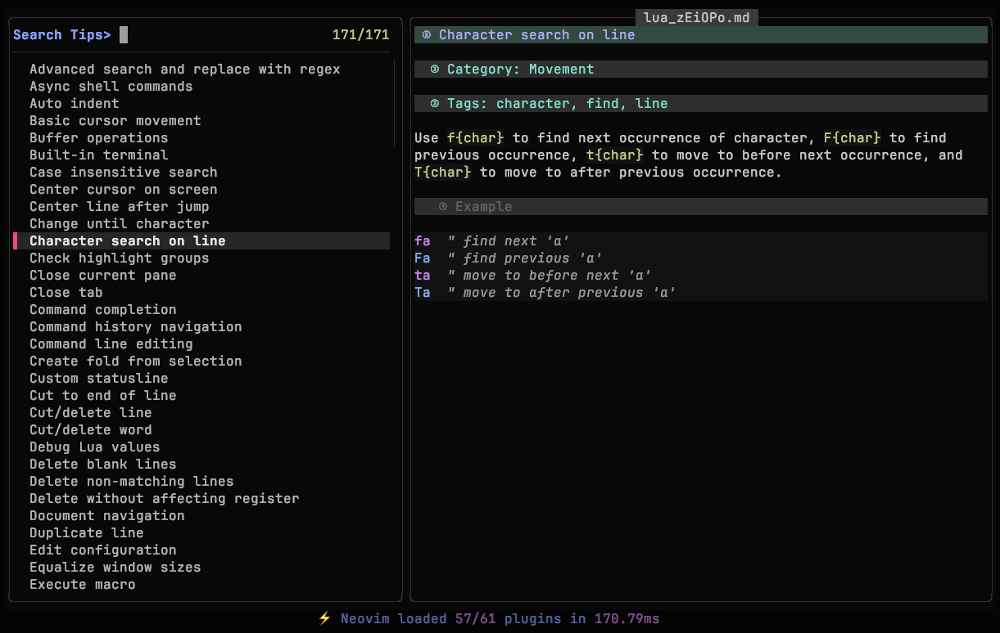

# Neovim Tips Plugin

*A Lua plugin for Neovim that helps you organize and search over 550 helpful tips, tricks, and shortcuts via a fuzzy search interface.*



## 🎯 Purpose

I started to work on this little plugin because I **love** neovim and I still remember how difficult it was to learn the basic commands. I was like that [Twitter guy](https://x.com/iamdevloper/status/435555976687923200) who said: 

*"I've been using Vim for about 2 years now, mostly because I can't figure out how to exit it."*

The plugin should help you to learn some basic (:wq, write and quit) and some not so basic commands (ddp, move line down) related to neovim. 

## 🤝 Let's Collaborate

I have provided a solid initial batch of tips and if you have your favorite one that is not listed, I will be happy to include it in the next release **with proper credits**. Send your commands, tips and tricks to me, create an issue or submit a pull request. You can also add your own tips and tricks that will be stored on your local computer, you don't have to share anything with me.  

## ✨ Features
- Search tips using ultra-fast `fzf-lua` plugin
- Preview rendered descriptions in markdown format
- No additional utilities: you don't need `glow` or `bat` to render the tip
- Support for categories, tags, and rich text
- The plugin comes with a starting set of basic, predefined tips
- You can add/edit unlimited number of personal tips stored in a configurable file
- User tips with configurable prefixes to prevent conflicts with builtin tips
- Automatic conflict detection and warnings

## 📦 Installation

### Lazy.nvim

```lua
{
  "saxon1964/neovim-tips",
  dependencies = { "ibhagwan/fzf-lua" },
  opts = {
    -- OPTIONAL: Location of user defined tips (default value shown below)
    user_file = vim.fn.stdpath("config") .. "/neovim_tips/user_tips.md",
    -- OPTIONAL: Prefix for user tips to avoid conflicts (default: "[User] ")
    user_tip_prefix = "[User] ",
    -- OPTIONAL: Show warnings when user tips conflict with builtin (default: true)
    warn_on_conflicts = true,
  },
  init = function()
    -- OPTIONAL: Change to your liking or drop completely 
    -- The plugin does not provide default key mappings, only commands
    local map = vim.keymap.set
    map("n", "<leader>nto", ":NeovimTips<CR>", { desc = "Neovim tips", noremap = true, silent = true })
    map("n", "<leader>nte", ":NeovimTipsEdit<CR>", { desc = "Edit your Neovim tips", noremap = true, silent = true })
    map("n", "<leader>nta", ":NeovimTipsAdd<CR>", { desc = "Add your Neovim tip", noremap = true, silent = true })
    map("n", "<leader>nth", ":NeovimTipsHelp<CR>", { desc = "Neovim tips user guide", noremap = true, silent = true })
  end
}
```

### packer.nvim

```lua
use {
  "saxon1964/neovim-tips",
  requires = { "ibhagwan/fzf-lua" },
  config = function()
    require("neovim_tips").setup {
      user_file = vim.fn.stdpath("config") .. "/neovim_tips/user_tips.md",
      user_tip_prefix = "[User] ",  -- Prefix for user tips
      warn_on_conflicts = true,     -- Warn about title conflicts
    }

    local map = vim.keymap.set
    map("n", "<leader>nto", ":NeovimTips<CR>", { desc = "Neovim tips", noremap = true, silent = true })
    map("n", "<leader>nte", ":NeovimTipsEdit<CR>", { desc = "Edit your Neovim tips", noremap = true, silent = true })
    map("n", "<leader>nta", ":NeovimTipsAdd<CR>", { desc = "Add your Neovim tip", noremap = true, silent = true })
    map("n", "<leader>nth", ":NeovimTipsHelp<CR>", { desc = "Neovim tips user guide", noremap = true, silent = true })
  end
}
```

### vim-plug

```vim
Plug 'ibhagwan/fzf-lua'
Plug 'saxon1964/neovim-tips'

lua << EOF
require("neovim_tips").setup {
  user_file = vim.fn.stdpath("config") .. "/neovim_tips/user_tips.txt",
}

local map = vim.keymap.set
map("n", "<leader>nto", ":NeovimTips<CR>", { desc = "Neovim tips", noremap = true, silent = true })
map("n", "<leader>nte", ":NeovimTipsEdit<CR>", { desc = "Edit your Neovim tips", noremap = true, silent = true })
map("n", "<leader>nta", ":NeovimTipsAdd<CR>", { desc = "Add your Neovim tip", noremap = true, silent = true })
EOF
```

### minpac

```vim
call minpac#init()
call minpac#add('ibhagwan/fzf-lua')
call minpac#add('saxon1964/neovim-tips')

lua << EOF
require("neovim_tips").setup {
  user_file = vim.fn.stdpath("config") .. "/neovim_tips/user_tips.txt",
}

local map = vim.keymap.set
map("n", "<leader>nto", ":NeovimTips<CR>", { desc = "Neovim tips", noremap = true, silent = true })
map("n", "<leader>nte", ":NeovimTipsEdit<CR>", { desc = "Edit your Neovim tips", noremap = true, silent = true })
map("n", "<leader>nta", ":NeovimTipsAdd<CR>", { desc = "Add your Neovim tip", noremap = true, silent = true })
EOF
```

### paq-nvim

```lua
require "paq" {
  "ibhagwan/fzf-lua";
  "saxon1964/neovim-tips";
}

require("neovim_tips").setup {
  user_file = vim.fn.stdpath("config") .. "/neovim_tips/user_tips.txt",
}

local map = vim.keymap.set
map("n", "<leader>nto", ":NeovimTips<CR>", { desc = "Neovim tips", noremap = true, silent = true })
map("n", "<leader>nte", ":NeovimTipsEdit<CR>", { desc = "Edit your Neovim tips", noremap = true, silent = true })
map("n", "<leader>nta", ":NeovimTipsAdd<CR>", { desc = "Add your Neovim tip", noremap = true, silent = true })
```

### dein.vim

```vim
call dein#begin('~/.cache/dein')

call dein#add('ibhagwan/fzf-lua')
call dein#add('saxon1964/neovim-tips')

call dein#end()

lua << EOF
require("neovim_tips").setup {
  user_file = vim.fn.stdpath("config") .. "/neovim_tips/user_tips.txt",
}

local map = vim.keymap.set
map("n", "<leader>nto", ":NeovimTips<CR>", { desc = "Neovim tips", noremap = true, silent = true })
map("n", "<leader>nte", ":NeovimTipsEdit<CR>", { desc = "Edit your Neovim tips", noremap = true, silent = true })
map("n", "<leader>nta", ":NeovimTipsAdd<CR>", { desc = "Add your Neovim tip", noremap = true, silent = true })
EOF

```

### kickstart.nvim

```lua
require("lazy").setup({
  {
    "saxon1964/neovim-tips",
    dependencies = { "ibhagwan/fzf-lua" },
    opts = {
      user_file = vim.fn.stdpath("config") .. "/neovim_tips/user_tips.txt",
    },
    init = function()
      local map = vim.keymap.set
      map("n", "<leader>nto", ":NeovimTips<CR>", { desc = "Neovim tips", noremap = true, silent = true })
      map("n", "<leader>nte", ":NeovimTipsEdit<CR>", { desc = "Edit your Neovim tips", noremap = true, silent = true })
      map("n", "<leader>nta", ":NeovimTipsAdd<CR>", { desc = "Add your Neovim tip", noremap = true, silent = true })
    end,
  },
})
```

### AstroNvim

File `lua/user/plugins/neovim_tips.lua`:

```lua
return {
  {
    "saxon1964/neovim-tips",
    dependencies = { "ibhagwan/fzf-lua" },
    opts = {
      user_file = vim.fn.stdpath("config") .. "/neovim_tips/user_tips.txt",
    },
  },
}
```

File `lua/user/mappings.lua`

```lua
return {
  n = {
    ["<leader>nto"] = { "<cmd>NeovimTips<cr>", desc = "Neovim tips" },
    ["<leader>nte"] = { "<cmd>NeovimTipsEdit<cr>", desc = "Edit your Neovim tips" },
    ["<leader>nta"] = { "<cmd>NeovimTipsAdd<cr>", desc = "Add your Neovim tip" },
    ["<leader>nth"] = { "<cmd>NeovimTipsHelp<cr>", desc = "Neovim tips user guide" },
  },
}
```

## 🔧 Commands

- `:NeovimTips` — Open searchable list of tips
- `:NeovimTipsEdit` — Edit your personal tips file
- `:NeovimTipsAdd` — Insert a new tip template into your personal file and start editing
- `:NeovimTipsHelp` — Open the user guide in a read-only buffer

## 📝 Tips

Each tip should follow this format in your tips file:

````
# Title: My tip title
# Category: My category name
# Tags: tag1, tag2, tag3
---
This is a description of what the tip does.

```vim
normal-mode-command
```
===
````

Description of the tip starts with --- and ends with ===. There is **NO** predefined format for description. Anything between the starting and ending marker will be interpreted as a text in markdown (.md) format. Fzf-lua will render the markdown description in the right FZF panel. 

## ✅ Example

````
# Title: Delete word under the cursor
# Category: Edit
# Tags: delete, word, cursor
---
In normal mode use `:diw` to delete the word under the cursor.

```vim
:diw
```
===
````

## 📝 User-Defined Tips

The author of this plugin has done his best to provide a significant number of built-in Neovim commands, tips and tricks. But Neovim is an endless source of inspiration to many and, I believe, to you as well.

It is possible to mix your own tips with the built-in collection. Use `:NeovimTipsAdd` to add your own tip to the collection or `:NeovimTipsEdit` to edit the file with your custom tips. If the file for your custom tips does not exist, it will be created automatically.

### User Tip Format

User tips follow the same format as builtin tips:

````markdown
# Title: Your custom tip title
# Category: Your Category 
# Tags: tag1, tag2, tag3
---
Your tip description goes here.

#### Example

```vim
:YourCommand  " your example
```
===
````

Anything between `---` and `===` is considered to be a tip description in markdown text format and will be rendered accordingly.

### Conflict Prevention

To prevent conflicts with builtin tips, user tips are automatically prefixed with `[User] ` by default. Do **NOT** add the prefix yourself. This means if you create a tip with the title `Join lines`, it will appear as `[User] Join lines` in the interface and will not interfere with the built-in tip with the title `Join lines`.

## ⚙️ Configuration Options

All configuration options are optional with sensible defaults:

```lua
require("neovim_tips").setup({
  -- Path to user tips file
  user_file = vim.fn.stdpath("config") .. "/neovim_tips/user_tips.md",
  
  -- Prefix added to user tip titles to prevent conflicts
  user_tip_prefix = "[User] ",
  
  -- Show warnings when user tips have conflicting titles with builtin tips
  warn_on_conflicts = true,
  
  -- Path to builtin tips directory (usually not changed)
  builtin_dir = "<plugin_path>/data",
})
```

### User Tip Prefix Examples

```lua
-- Default: [User] prefix
user_tip_prefix = "[User] "     -- "Join lines" becomes "[User] Join lines"

-- Custom emoji prefix  
user_tip_prefix = "🔧 "         -- "Join lines" becomes "🔧 Join lines"

-- No prefix (not recommended, may cause conflicts)
user_tip_prefix = ""            -- "Join lines" stays "Join lines"
```

### Features

- **Automatic prefixing**: User tips are automatically prefixed to avoid conflicts
- **Conflict detection**: Warnings when user tip titles match builtin tips
- **User tag**: All user tips automatically get a "user" tag for filtering
- **Same format**: User tips follow the exact same format as builtin tips

### Tips for Writing User Tips

- Use descriptive, unique titles
- Include relevant tags for easy searching
- Provide clear examples when applicable
- Test your tips before adding them
- Consider if your tip might be useful as a contribution to the main collection

## 📁 Default File Locations

- Built-in tips: `<plugin_directory>/data/`
- User tips: `~/.config/nvim/neovim_tips/user_tips.md`

## 🔄 Roadmap Ideas

- Category filtering
- Search descriptions
- Support for other popular pickers (telescope, snacks, mini...)
- Lazy loading
- Multiple tip sources

## ⚖️ License

- Unlicense. You can find more details in the license file or [here](https://unlicense.org) 

