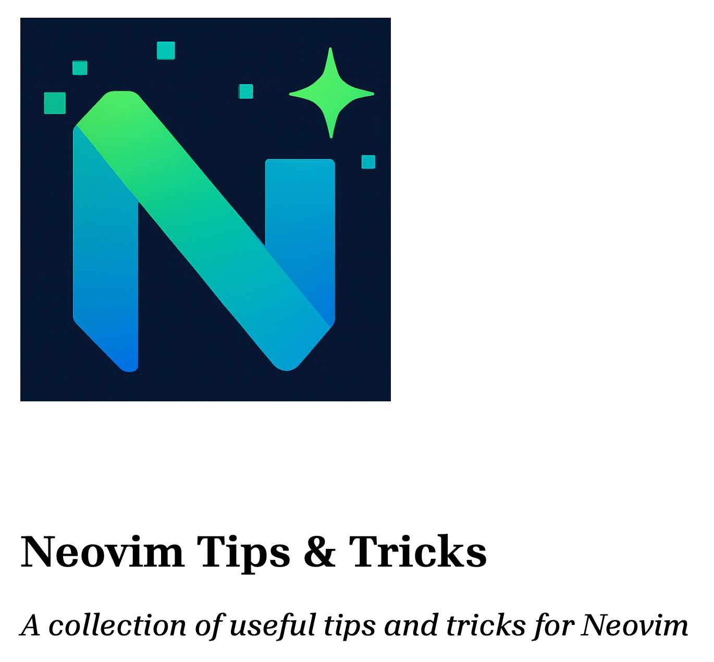
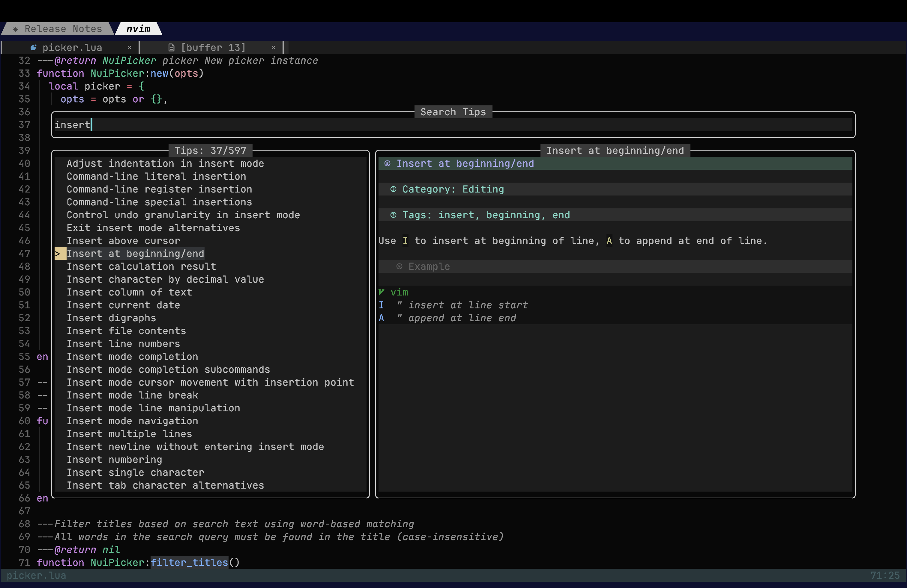
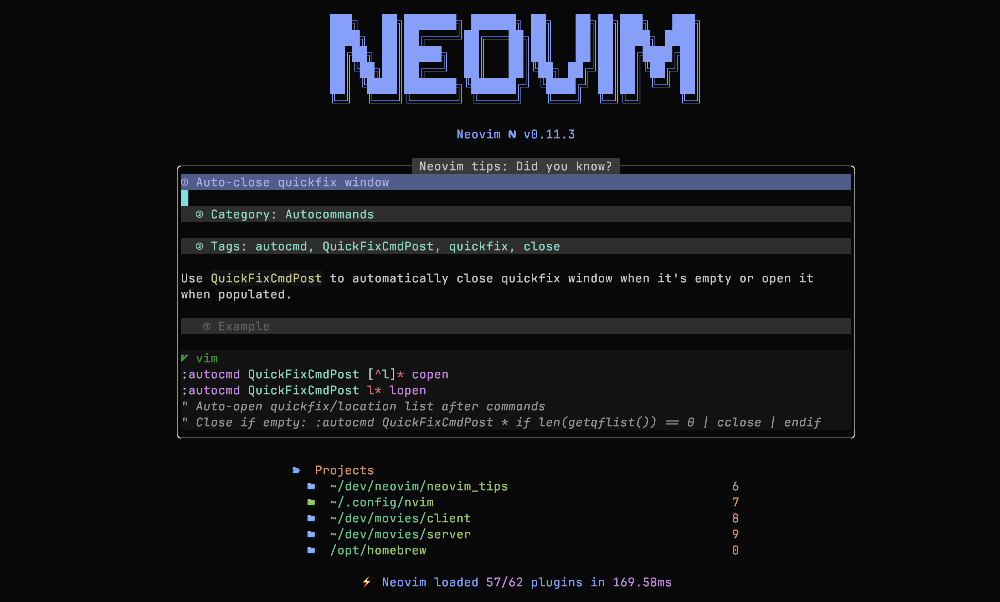
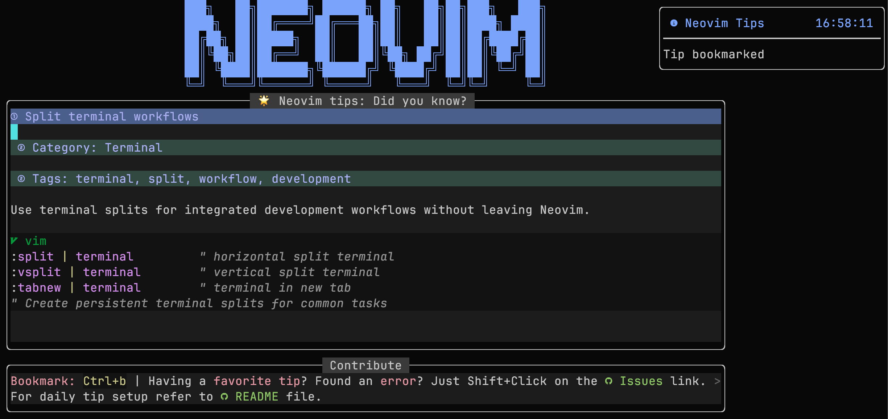
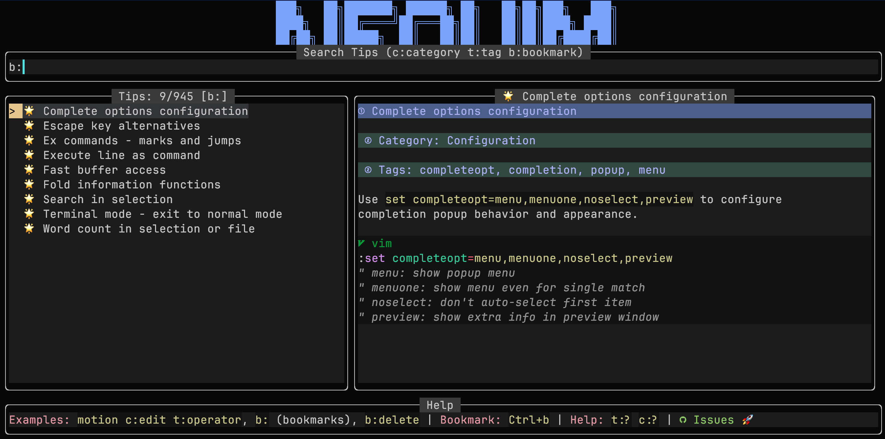
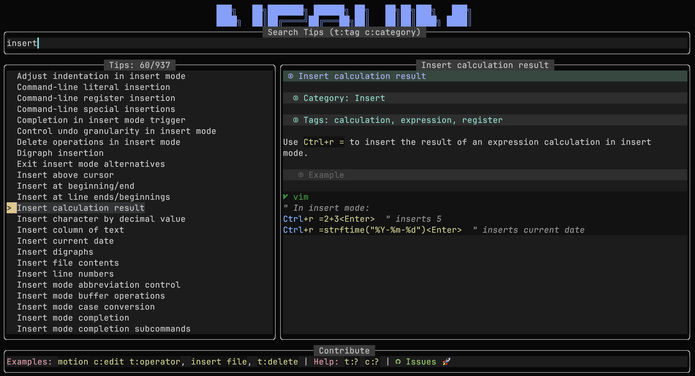
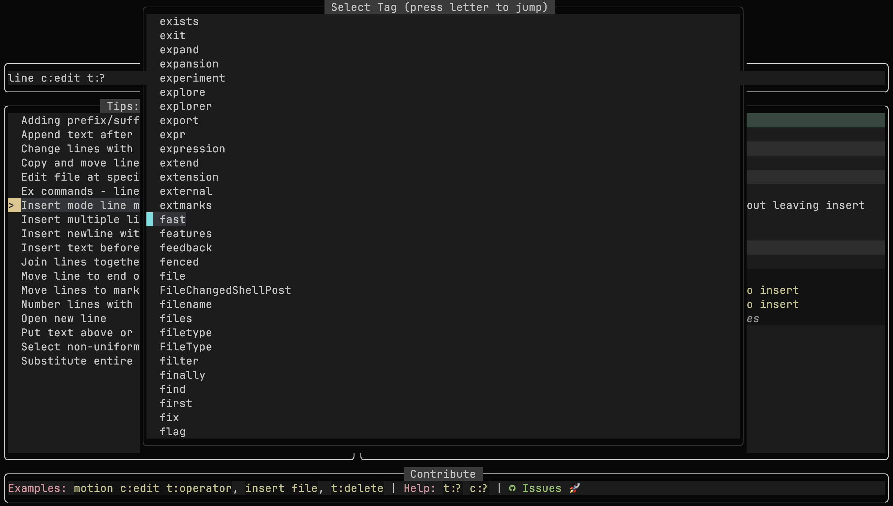

# Neovim Tips Plugin

> *"I've been using Vim for about 2 years now, mostly because I can't figure out how to exit it."* ([I Am Developer](https://x.com/iamdevloper/status/435555976687923200))

**This Lua plugin for Neovim brings together hundreds of helpful tips, tricks, and shortcuts, all available through a custom picker. It's easy to expand with your own entries, so the collection grows with you and your workflow.**

## 📷 Screenshots

<p align="center">Neovim Tips main screen</p>



<p align="center">Neovim Daily/Random tip</p>



<p align="center">Bookmarking Daily/Random tip</p>



<p align="center">List your bookmarked tips</p>



<p align="center">Searching tips database</p>



<p align="center">Advanced tips search using categories, tags and bookmarks</p>



## 📚 Table of Contents

- [🎯 Purpose](#-purpose)
- [🤝 Let's Collaborate](#-lets-collaborate)
- [✨ Features](#-features)
- [📦 Installation](#-installation)
  - [Lazy.nvim](#lazynvim)
  - [packer.nvim](#packernvim)
  - [vim-plug](#vim-plug)
  - [minpac](#minpac)
  - [paq-nvim](#paq-nvim)
  - [dein.vim](#deinvim)
  - [vim.pack](#vimpack)
  - [kickstart.nvim](#kickstartnvim)
  - [AstroNvim](#astronvim)
- [💡 Daily Tip Feature](#-daily-tip-feature)
- [🔧 Commands](#-commands)
- [📖 Help System](#-help-system)
- [🔍 Smart Search](#-smart-search)
- [📂 Available Categories](#-available-categories)
- [📝 Tips](#-tips)
- [✅ Example](#-example)
- [📝 User-Defined Tips](#-user-defined-tips)
- [⚙️ Configuration Options](#️-configuration-options)
- [🚫 Disabling Completion in Search Bar](#-disabling-completion-in-search-bar)
- [📁 Default File Locations](#-default-file-locations)
- [🔄 Roadmap Ideas](#-roadmap-ideas)

## 🎯 Purpose

I started to work on this little plugin because I **love** neovim and I still remember how difficult it was to learn the basic commands.

The plugin should help you to learn some basic (:wq, write and quit) and some not so basic commands (ddp, move line down) related to neovim.

## 🤝 Let's Collaborate

I have provided a solid initial batch of tips and if you have your favorite one that is not listed, I will be happy to include it in the next release **with proper credits**. Send your commands, tips and tricks to me, create an issue or submit a pull request. You can also add your own tips and tricks that will be stored on your local computer, you don't have to share anything with me.

## ✨ Features

- **Beautiful custom picker**: Three-pane interface with search, tips list, and live markdown preview
- **Daily tip popup**: Get a random tip on startup (configurable: off, daily, or every launch)
- **Lightweight dependencies**: Only requires `nui.nvim` - no heavyweight pickers (fzf-lua, telescope, snacks, mini...)
- **Flexible markdown rendering**: Supports `markview.nvim`, `render-markdown.nvim`, or raw markdown display (auto-detected)
- **Word-based search**: Intelligent search that matches all words (e.g., "insert character" finds "character to insert")
- **Live markdown preview**: Rich formatted descriptions or clean raw markdown based on your preference
- **Simple navigation**: Seamless mouse and keyboard navigation with smart mode switching
- **Copy-friendly**: Easy copying of tip content and code snippets from both picker and daily tip
- **Cursor preservation**: Returns to your exact cursor position and mode after closing
- **Bookmark system**: Save favorite tips with customizable visual indicators (🌟 ⭐ ✨ 💫 🔥 💎 etc.)
- **Smart caching**: Automatic serialization of parsed tips for 10-20x faster loading (optional, enabled by default)
- Support for categories, tags, and rich text
- Lazy loading for optimal startup performance
- The plugin comes with a starting set of 1000+ curated tips
- You can add/edit unlimited number of personal tips stored in a configurable file
- User tips with configurable prefixes to prevent conflicts with builtin tips
- Automatic title conflict detection and warnings

## 📦 Installation

### Lazy.nvim

```lua
{
  "saxon1964/neovim-tips",
  version = "*", -- Only update on tagged releases
  lazy = false,  -- Load on startup (recommended for daily tip feature)
  dependencies = {
    "MunifTanjim/nui.nvim",
    -- OPTIONAL: Choose your preferred markdown renderer (or omit for raw markdown)
    "MeanderingProgrammer/render-markdown.nvim", -- Clean rendering
    -- OR: "OXY2DEV/markview.nvim", -- Rich rendering with advanced features
  },
  opts = {
    -- OPTIONAL: Location of user defined tips (default value shown below)
    user_file = vim.fn.stdpath("config") .. "/neovim_tips/user_tips.md",
    -- OPTIONAL: Prefix for user tips to avoid conflicts (default: "[User] ")
    user_tip_prefix = "[User] ",
    -- OPTIONAL: Show warnings when user tips conflict with builtin (default: true)
    warn_on_conflicts = true,
    -- OPTIONAL: Daily tip mode (default: 1)
    -- 0 = off, 1 = once per day, 2 = every startup
    daily_tip = 1,
    -- OPTIONAL: Bookmark symbol (default: "🌟 ")
    bookmark_symbol = "🌟 ",
  },
  init = function()
    -- OPTIONAL: Change to your liking or drop completely
    -- The plugin does not provide default key mappings, only commands
    local map = vim.keymap.set
    map("n", "<leader>nto", ":NeovimTips<CR>", { desc = "Neovim tips", noremap = true, silent = true })
    map("n", "<leader>nte", ":NeovimTipsEdit<CR>", { desc = "Edit your Neovim tips", noremap = true, silent = true })
    map("n", "<leader>nta", ":NeovimTipsAdd<CR>", { desc = "Add your Neovim tip", noremap = true, silent = true })
    map("n", "<leader>nth", ":help neovim-tips<CR>", { desc = "Neovim tips help", noremap = true, silent = true })
    map("n", "<leader>ntr", ":NeovimTipsRandom<CR>", { desc = "Show random tip", noremap = true, silent = true })
    map("n", "<leader>ntp", ":NeovimTipsPdf<CR>", { desc = "Open Neovim tips PDF", noremap = true, silent = true })
  end
}
```

### packer.nvim

```lua
use {
  "saxon1964/neovim-tips",
  tag = "*", -- Only update on tagged releases
  requires = {
    "MunifTanjim/nui.nvim",
    -- OPTIONAL: Choose your preferred renderer
    "MeanderingProgrammer/render-markdown.nvim", -- OR "OXY2DEV/markview.nvim"
  },
  config = function()
    require("neovim_tips").setup {
      user_file = vim.fn.stdpath("config") .. "/neovim_tips/user_tips.md",
      user_tip_prefix = "[User] ",  -- Prefix for user tips
      warn_on_conflicts = true,     -- Warn about title conflicts
      daily_tip = 1,                -- Daily tip: 0=off, 1=once per day, 2=every startup
    }

    local map = vim.keymap.set
    map("n", "<leader>nto", ":NeovimTips<CR>", { desc = "Neovim tips", noremap = true, silent = true })
    map("n", "<leader>nte", ":NeovimTipsEdit<CR>", { desc = "Edit your Neovim tips", noremap = true, silent = true })
    map("n", "<leader>nta", ":NeovimTipsAdd<CR>", { desc = "Add your Neovim tip", noremap = true, silent = true })
    map("n", "<leader>nth", ":help neovim-tips<CR>", { desc = "Neovim tips help", noremap = true, silent = true })
    map("n", "<leader>ntr", ":NeovimTipsRandom<CR>", { desc = "Show random tip", noremap = true, silent = true })
    map("n", "<leader>ntp", ":NeovimTipsPdf<CR>", { desc = "Open Neovim tips PDF", noremap = true, silent = true })
  end
}
```

### vim-plug

```vim
Plug 'MunifTanjim/nui.nvim'
Plug 'MeanderingProgrammer/render-markdown.nvim'
Plug 'saxon1964/neovim-tips', { 'tag': '*' } " Only update on tagged releases

lua << EOF
require("neovim_tips").setup {
  user_file = vim.fn.stdpath("config") .. "/neovim_tips/user_tips.md",
  daily_tip = 1,  -- Daily tip: 0=off, 1=once per day, 2=every startup
}

local map = vim.keymap.set
map("n", "<leader>nto", ":NeovimTips<CR>", { desc = "Neovim tips", noremap = true, silent = true })
map("n", "<leader>nte", ":NeovimTipsEdit<CR>", { desc = "Edit your Neovim tips", noremap = true, silent = true })
map("n", "<leader>nta", ":NeovimTipsAdd<CR>", { desc = "Add your Neovim tip", noremap = true, silent = true })
map("n", "<leader>nth", ":help neovim-tips<CR>", { desc = "Neovim tips help", noremap = true, silent = true })
map("n", "<leader>ntr", ":NeovimTipsRandom<CR>", { desc = "Show random tip", noremap = true, silent = true })
map("n", "<leader>ntp", ":NeovimTipsPdf<CR>", { desc = "Open Neovim tips PDF", noremap = true, silent = true })
EOF
```

### minpac

```vim
call minpac#init()
call minpac#add('MunifTanjim/nui.nvim')
call minpac#add('MeanderingProgrammer/render-markdown.nvim')
call minpac#add('saxon1964/neovim-tips', {'tag': '*'}) " Only update on tagged releases

lua << EOF
require("neovim_tips").setup {
  user_file = vim.fn.stdpath("config") .. "/neovim_tips/user_tips.md",
  daily_tip = 1,  -- Daily tip: 0=off, 1=once per day, 2=every startup
}

local map = vim.keymap.set
map("n", "<leader>nto", ":NeovimTips<CR>", { desc = "Neovim tips", noremap = true, silent = true })
map("n", "<leader>nte", ":NeovimTipsEdit<CR>", { desc = "Edit your Neovim tips", noremap = true, silent = true })
map("n", "<leader>nta", ":NeovimTipsAdd<CR>", { desc = "Add your Neovim tip", noremap = true, silent = true })
map("n", "<leader>nth", ":help neovim-tips<CR>", { desc = "Neovim tips help", noremap = true, silent = true })
map("n", "<leader>ntr", ":NeovimTipsRandom<CR>", { desc = "Show random tip", noremap = true, silent = true })
map("n", "<leader>ntp", ":NeovimTipsPdf<CR>", { desc = "Open Neovim tips PDF", noremap = true, silent = true })
EOF
```

### paq-nvim

```lua
require "paq" {
  "MunifTanjim/nui.nvim";
  "MeanderingProgrammer/render-markdown.nvim";
  { "saxon1964/neovim-tips", tag = "*" }; -- Only update on tagged releases
}

require("neovim_tips").setup {
  user_file = vim.fn.stdpath("config") .. "/neovim_tips/user_tips.md",
  daily_tip = 1,  -- Daily tip: 0=off, 1=once per day, 2=every startup
}

local map = vim.keymap.set
map("n", "<leader>nto", ":NeovimTips<CR>", { desc = "Neovim tips", noremap = true, silent = true })
map("n", "<leader>nte", ":NeovimTipsEdit<CR>", { desc = "Edit your Neovim tips", noremap = true, silent = true })
map("n", "<leader>nta", ":NeovimTipsAdd<CR>", { desc = "Add your Neovim tip", noremap = true, silent = true })
map("n", "<leader>nth", ":help neovim-tips<CR>", { desc = "Neovim tips help", noremap = true, silent = true })
map("n", "<leader>ntr", ":NeovimTipsRandom<CR>", { desc = "Show random tip", noremap = true, silent = true })
```

### dein.vim

```vim
call dein#begin('~/.cache/dein')

call dein#add('MunifTanjim/nui.nvim')
call dein#add('MeanderingProgrammer/render-markdown.nvim')
call dein#add('saxon1964/neovim-tips')

call dein#end()

lua << EOF
require("neovim_tips").setup {
  user_file = vim.fn.stdpath("config") .. "/neovim_tips/user_tips.md",
  daily_tip = 1,  -- Daily tip: 0=off, 1=once per day, 2=every startup
}

local map = vim.keymap.set
map("n", "<leader>nto", ":NeovimTips<CR>", { desc = "Neovim tips", noremap = true, silent = true })
map("n", "<leader>nte", ":NeovimTipsEdit<CR>", { desc = "Edit your Neovim tips", noremap = true, silent = true })
map("n", "<leader>nta", ":NeovimTipsAdd<CR>", { desc = "Add your Neovim tip", noremap = true, silent = true })
map("n", "<leader>nth", ":help neovim-tips<CR>", { desc = "Neovim tips help", noremap = true, silent = true })
map("n", "<leader>ntr", ":NeovimTipsRandom<CR>", { desc = "Show random tip", noremap = true, silent = true })
map("n", "<leader>ntp", ":NeovimTipsPdf<CR>", { desc = "Open Neovim tips PDF", noremap = true, silent = true })
EOF

```

### vim.pack

> WARNING: vim.pac, Neovim's built-in plugin manager, is still being developed! Early testing of existing features is appreciated, but expect breaking changes without notice. More information can be found in the [official documentation](https://neovim.io/doc/user/pack.html#vim.pack).

```lua
vim.pack.add({
	"https://github.com/MunifTanjim/nui.nvim",
	"https://github.com/saxon1964/neovim-tips",
})

require("neovim_tips").setup({
	-- Path to user tips file
	user_file = vim.fn.stdpath("config") .. "/neovim_tips/user_tips.md",

	-- Prefix added to user tip titles to prevent conflicts
	user_tip_prefix = "[User] ",

	-- Show warnings when user tips have conflicting titles with builtin tips
	warn_on_conflicts = true,

	-- Daily tip mode: 0=off, 1=once per day, 2=every startup
	daily_tip = 1,
})

local map = vim.keymap.set
map("n", "<leader>nto", ":NeovimTips<CR>", { desc = "Neovim tips", noremap = true, silent = true })
map("n", "<leader>nte", ":NeovimTipsEdit<CR>", { desc = "Edit your Neovim tips", noremap = true, silent = true })
map("n", "<leader>nta", ":NeovimTipsAdd<CR>", { desc = "Add your Neovim tip", noremap = true, silent = true })
map("n", "<leader>nth", ":help neovim-tips<CR>", { desc = "Neovim tips help", noremap = true, silent = true })
map("n", "<leader>ntr", ":NeovimTipsRandom<CR>", { desc = "Show random tip", noremap = true, silent = true })
map("n", "<leader>ntp", ":NeovimTipsPdf<CR>", { desc = "Open Neovim tips PDF", noremap = true, silent = true })
```

### kickstart.nvim

```lua
require("lazy").setup({
  {
    "saxon1964/neovim-tips",
    dependencies = {
    "MunifTanjim/nui.nvim",
    "MeanderingProgrammer/render-markdown.nvim"
  },
    opts = {
      user_file = vim.fn.stdpath("config") .. "/neovim_tips/user_tips.md",
    },
    init = function()
      local map = vim.keymap.set
      map("n", "<leader>nto", ":NeovimTips<CR>", { desc = "Neovim tips", noremap = true, silent = true })
      map("n", "<leader>nte", ":NeovimTipsEdit<CR>", { desc = "Edit your Neovim tips", noremap = true, silent = true })
      map("n", "<leader>nta", ":NeovimTipsAdd<CR>", { desc = "Add your Neovim tip", noremap = true, silent = true })
      map("n", "<leader>nth", ":help neovim-tips<CR>", { desc = "Neovim tips help", noremap = true, silent = true })
      map("n", "<leader>ntr", ":NeovimTipsRandom<CR>", { desc = "Show random tip", noremap = true, silent = true })
      map("n", "<leader>ntp", ":NeovimTipsPdf<CR>", { desc = "Open Neovim tips PDF", noremap = true, silent = true })
    end,
  },
})
```

### AstroNvim

File `lua/user/plugins/neovim_tips.lua`:

```lua
return {
  {
    "saxon1964/neovim-tips",
    dependencies = {
    "MunifTanjim/nui.nvim",
    "MeanderingProgrammer/render-markdown.nvim"
  },
    opts = {
      user_file = vim.fn.stdpath("config") .. "/neovim_tips/user_tips.md",
    },
  },
}
```

File `lua/user/mappings.lua`

```lua
return {
  n = {
    ["<leader>nto"] = { "<cmd>NeovimTips<cr>", desc = "Neovim tips" },
    ["<leader>nte"] = { "<cmd>NeovimTipsEdit<cr>", desc = "Edit your Neovim tips" },
    ["<leader>nta"] = { "<cmd>NeovimTipsAdd<cr>", desc = "Add your Neovim tip" },
    ["<leader>nth"] = { "<cmd>help neovim-tips<cr>", desc = "Neovim tips help" },
    ["<leader>ntr"] = { "<cmd>NeovimTipsRandom<cr>", desc = "Random Neovim tip" },
    ["<leader>ntp"] = { "<cmd>NeovimTipsPdf<cr>", desc = "Open Neovim tips PDF" },
  },
}
```

## 💡 Daily Tip Feature

The plugin can show you a random tip in a beautiful popup when you start Neovim. This helps you discover new tips and improve your workflow naturally.

### Configuration Options:
- `daily_tip = 0`: Disabled (no popup)
- `daily_tip = 1`: Once per day (default)
- `daily_tip = 2`: Every Neovim startup

### Daily Tip Popup Features:
- **"Did you know?" popup**: Centered layout with main tip content and footer
- **Smart persistence**: Once daily mode uses `~/.local/share/nvim/neovim_tips/persistent.json`
- **Full markdown rendering**: Rich formatting with render-markdown.nvim
- **Easy copying**: Select and copy tip content or code snippets directly
- **Easy dismissal**: Close with `q` or `<Esc>`
- **Contribution links**: Footer includes GitHub issues link for feedback


## 📖 PDF Book Export

All tips have been compiled into a beautifully formatted PDF book with almost 400 pages that you can read offline or print for reference.


### Opening the PDF Book

Use the `:NeovimTipsPdf` command to open the PDF book in your system's default PDF viewer:

```vim
:NeovimTipsPdf
```

The command automatically detects your operating system and uses the appropriate command:
- **macOS**: `open`
- **Linux**: `xdg-open` (with fallbacks to `gnome-open` or `kde-open`)
- **Windows**: `start`

The PDF is located at `pdf/book/NeovimTips.pdf` within the plugin directory and includes all 945+ tips organized by category with a professional layout.

## 🔧 Commands

- `:NeovimTips` — Open searchable list of tips with beautiful three-pane interface
- `:NeovimTipsEdit` — Edit your personal tips file
- `:NeovimTipsAdd` — Insert a new tip template into your personal file and start editing
- `:NeovimTipsRandom` — Displays random tip upon user request
- `:NeovimTipsReload` — Reload all tips and clear cache (useful after editing markdown files)
- `:NeovimTipsCacheInfo` — Show cache statistics and status
- `:NeovimTipsPdf` — Open the PDF version of tips collection

## 🎨 Markdown Rendering

The plugin automatically detects and uses available markdown renderers for enhanced tip display:

### 📋 Rendering Options

1. **markview.nvim** (Priority 1)
   - Rich rendering with advanced features
   - Beautiful typography and syntax highlighting
   - Install: Add `"OXY2DEV/markview.nvim"` to dependencies

2. **render-markdown.nvim** (Priority 2)
   - Clean, lightweight rendering
   - Excellent performance
   - Install: Add `"MeanderingProgrammer/render-markdown.nvim"` to dependencies

3. **Raw Markdown** (Fallback)
   - Clean, readable plain text
   - Zero dependencies beyond `nui.nvim`
   - Many users prefer this for its simplicity

### 🔄 Automatic Detection

The plugin automatically:
- Detects which renderer is available
- Uses markview.nvim if present (highest priority)
- Falls back to render-markdown.nvim if markview not found
- Displays raw markdown if no renderer installed
- **No configuration required** - just install your preferred renderer

## 📖 Help System

The plugin provides comprehensive built-in documentation accessible via Neovim's help system. All features, commands, and configuration options are documented with examples and cross-references.

### Main Help Topics

- `:help neovim-tips` — Complete plugin documentation
- `:help neovim-tips-commands` — All available commands
- `:help neovim-tips-search` — Advanced search syntax and examples
- `:help neovim-tips-configuration` — Configuration options with examples
- `:help neovim-tips-user-tips` — Creating and managing custom tips
- `:help neovim-tips-daily` — Daily tip feature configuration

### Individual Command Help

- `:help :NeovimTips` — Main picker command
- `:help :NeovimTipsEdit` — Edit personal tips file
- `:help :NeovimTipsAdd` — Add new tip template
- `:help :NeovimTipsRandom` — Random tip display

### Quick Access

The help system includes:
- **Detailed examples** for all search modes (`t:tag`, `c:category`, etc.)
- **Configuration templates** you can copy and customize
- **Troubleshooting guide** for common issues
- **Cross-referenced sections** for easy navigation between related topics

**Pro tip**: Start with `:help neovim-tips` for a complete overview, then use `:help neovim-tips-<topic>` for specific areas of interest.

## 🔍 Smart Search

The tips picker features powerful search capabilities that let you find tips by title, category, or tags with intelligent filtering.

### Basic Search

Simply start typing to search tip titles:
```
vim motion          → finds tips with both "vim" and "motion" in title
insert character    → finds tips about inserting characters
delete word         → finds tips about deleting words
```

### Tag Search

Use `t:` prefix to search by tags:
```
t:motion           → finds all tips tagged with "motion"
t:delete           → finds all tips tagged with "delete"
t:operator         → finds all tips tagged with "operator"
```

### Category Search

Use `c:` prefix to search by categories:
```
c:editing          → finds all tips in "Editing" category
c:search           → finds all tips in "Search" category
c:"Key Mappings"   → finds tips in "Key Mappings" category (quoted for spaces)
```

### Bookmark Search

Use `b:` prefix to search your bookmarked tips:
```
b:                 → shows all your bookmarked tips
b:delete           → shows bookmarked tips with "delete" in title
b:motion           → shows bookmarked tips with "motion" in title
```

**Bookmarking Tips:**
- Press **`Ctrl+b`** in the picker or daily tip to bookmark/unbookmark
- Bookmarked tips display with your configured symbol (default: 🌟)
- Works from any pane (search bar, tips list, or preview)

### Combined Search

Mix different search types with spaces (all must match):
```
motion c:editing t:operator    → tips with "motion" in title, "Editing" category, and "operator" tag
insert file t:save             → tips with "insert file" in title and "save" tag
b: c:editing t:motion          → bookmarked tips in "Editing" category with "motion" tag
b:delete c:text                → bookmarked tips with "delete" in title from "Text" category
```

### Search Help

Don't know what tags or categories are available? Use the help feature:

- **`t:?`** — Shows popup with all available tags (1000+ tags)
- **`c:?`** — Shows popup with all available categories (70+ categories)

#### Help Picker Navigation:
- **Arrow keys** or **j/k** — Navigate up/down
- **Press any letter** — Jump to first item starting with that letter (e.g., press 'm' to jump to "motion")
- **Enter** — Select the item
- **Esc** or **q** — Cancel

### Search Tips

- **Case insensitive**: `MOTION`, `motion`, and `Motion` all work the same
- **Word matching**: All words must be found (AND logic)
- **Quoted values**: Use quotes for multi-word tags/categories: `t:"write file"`
- **No results**: Both title list and preview clear when no matches found
- **Fast navigation**: Use help picker's letter jumping for quick access

### Examples

Try these searches to see the power of the system:
```
t:motion                       → 5 tips about motion commands
c:editing t:delete             → editing tips that involve deletion
motion c:editing t:operator    → 1 specific tip about motion + editing + operators
insert file                    → tips about inserting files
c:"Key Mappings" leader        → leader key mapping tips
```

## 📂 Available Categories

The plugin currently includes tips organized into **69+ categories**. Here's the complete list for easy reference when using category search (`c:category`):

<details>
<summary><strong>Click to expand categories list</strong></summary>

- **Advanced Neovim** - Advanced Neovim-specific features
- **Advanced Search** - Complex search patterns and techniques
- **Autocommands** - Event-driven automation
- **Buffer Management** - Working with buffers
- **Clever Tricks** - Creative solutions and shortcuts
- **Clipboard** - Copy/paste operations
- **Command Execution** - Running commands
- **Command History** - Command line history management
- **Command Line** - Command line usage
- **Command Line Advanced** - Advanced command line features
- **Completion** - Auto-completion features
- **Configuration** - Settings and configuration
- **Cut and Paste** - Text cutting and pasting
- **Development** - Programming and development
- **Diagnostics** - Error checking and diagnostics
- **Display** - Visual display options
- **Edit** - Basic editing operations
- **Editing** - Text editing techniques
- **Exit** - Exiting Vim/Neovim
- **File** - File operations
- **File History** - File change history
- **File Navigation** - Moving between files
- **File Operations** - Advanced file management
- **File Recovery** - Recovering files
- **File Type Specific** - Language-specific features
- **Folding** - Code folding
- **Formatting** - Text formatting
- **Fun** - Entertainment and fun features
- **Functions** - Function definitions and usage
- **Global** - Global operations
- **Help** - Getting help and documentation
- **Indentation** - Code indentation
- **Information** - System and editor information
- **Insert** - Insert mode operations
- **Insert Mode Advanced** - Advanced insert mode features
- **Integration** - External tool integration
- **Interface** - User interface features
- **Key Mappings** - Custom key bindings
- **LSP** - Language Server Protocol
- **Lua** - Lua scripting
- **Macros** - Recording and playing macros
- **Mapping** - Key mapping operations
- **Marks** - Text marks and bookmarks
- **Mode Switching** - Switching between modes
- **Movement** - Cursor movement
- **Navigation** - Code and text navigation
- **Neovim Features** - Neovim-specific functionality
- **Normal Mode** - Normal mode operations
- **Performance** - Performance optimization
- **Performance Optimization Advanced** - Advanced performance tips
- **Registers** - Using Vim registers
- **Scripting** - Script writing
- **Search** - Search and find operations
- **Search Replace** - Search and replace operations
- **Session** - Session management
- **Session Management** - Advanced session features
- **System** - System integration
- **System Information** - System data and info
- **Tabs** - Tab management
- **Terminal** - Terminal integration
- **Text Editing** - General text editing
- **Text Input** - Text input methods
- **Text Manipulation** - Advanced text operations
- **Text Objects** - Working with text objects
- **Treesitter** - Syntax tree parsing
- **UI** - User interface
- **View Management** - Managing views and layouts
- **Vim Script** - Vimscript programming
- **Visual** - Visual mode operations
- **Visual Mode Advanced** - Advanced visual mode features
- **Window Management** - Managing windows
- **Windows** - Window operations
- **Workflow** - Workflow optimization
- **Workflow Patterns** - Common workflow patterns

</details>

### Usage Examples:
```
c:editing                → All editing tips
c:"Key Mappings"         → All key mapping tips (quoted for spaces)
c:search t:pattern       → Search tips tagged with "pattern"
motion c:editing         → Motion tips in editing category
```

## 📝 Tips

Each tip should follow this format:

````
# Title: My tip title
# Category: My category name
# Tags: tag1, tag2, tag3
---
This is a description of what the tip does.

```vim
some-command
```

Some additional text here.
***
````

Alternatively, use can use === (3 equal signs) instead of *** (3 asterisks) to finish the tip.
This format is used for all tips, built-in or created by you and stored separately.

Each tip has to start with the `# Title:` line, followed by `# Category:` and a list of `# Tags`.

Description of the tip starts with `---` and ends with `***` or `===`. There is **NO** predefined format for description. Anything between the starting and ending marker will be interpreted as a text in markdown (.md) format. Fzf-lua will render the markdown description in the right FZF panel.

## ✅ Example

````
# Title: Delete word under the cursor
# Category: Edit
# Tags: delete, word, cursor
---
In normal mode use `diw` to delete the word under the cursor.

```vim
diw
```
***
````

## 📝 User-Defined Tips

The author of this plugin has done his best to provide a significant number of built-in Neovim commands, tips and tricks. But Neovim is an endless source of inspiration to many and, I believe, to you as well.

It is possible to mix your own tips with the built-in collection. Use `:NeovimTipsAdd` to add your own tip to the collection or `:NeovimTipsEdit` to edit the file with your custom tips. If the file for your custom tips does not exist, it will be created automatically. The location of the file can be adjusted (see "Configuration Options").

User tips follow the same format as builtin tips described above.

### Conflict Prevention

To prevent conflicts with builtin tips, user tips are automatically prefixed with `[User] ` by default. Do **NOT** add the prefix yourself. This means if you create a tip with the title `Join lines`, it will appear as `[User] Join lines` in the interface and will not interfere with the built-in tip with the title `Join lines`.

## ⚙️ Configuration Options

All configuration options are optional with sensible defaults. For detailed explanations and examples, see `:help neovim-tips-configuration`.

```lua
require("neovim_tips").setup({
  -- Path to user tips file
  user_file = vim.fn.stdpath("config") .. "/neovim_tips/user_tips.md",

  -- Prefix added to user tip titles to prevent conflicts
  user_tip_prefix = "[User] ",

  -- Show warnings when user tips have conflicting titles with builtin tips
  warn_on_conflicts = true,

  -- Daily tip mode: 0=off, 1=once per day, 2=every startup
  daily_tip = 1,

  -- Bookmark symbol (default: 🌟)
  bookmark_symbol = "🌟 ",

  -- Enable caching for faster loading (default: true, recommended)
  use_cache = true,
})
```

### User Tip Prefix Examples

```lua
-- Default: [User] prefix
user_tip_prefix = "[User] "     -- "Join lines" becomes "[User] Join lines"

-- Custom emoji prefix
user_tip_prefix = "🔧 "         -- "Join lines" becomes "🔧 Join lines"

-- No prefix (not recommended, may cause conflicts)
user_tip_prefix = ""            -- "Join lines" stays "Join lines"
```

### Bookmark Symbol Examples

```lua
-- Default star emoji
bookmark_symbol = "🌟 "          -- bright gold star

-- Alternative star options
bookmark_symbol = "⭐ "          -- classic star
bookmark_symbol = "✨ "          -- sparkles
bookmark_symbol = "💫 "          -- dizzy star

-- Other colorful options
bookmark_symbol = "🔥 "          -- fire
bookmark_symbol = "💎 "          -- gem
bookmark_symbol = "🏆 "          -- trophy
bookmark_symbol = "⚡ "          -- lightning
bookmark_symbol = "🎯 "          -- target
bookmark_symbol = "📌 "          -- pin

-- Simple text options
bookmark_symbol = "★ "           -- unicode star
bookmark_symbol = "[★] "         -- bracketed star
bookmark_symbol = "• "           -- bullet point
```

### Features

- **Automatic prefixing**: User tips are automatically prefixed to avoid conflicts
- **Conflict detection**: Warnings when user tip titles match builtin tips
- **User tag**: All user tips automatically get a "user" tag for filtering
- **Same format**: User tips follow the exact same format as builtin tips

### Tips for Writing User Tips

- Use descriptive, unique titles
- Include relevant tags for easy searching
- Provide clear examples when applicable
- Test your tips before adding them
- Consider if your tip might be useful as a contribution to the main collection

## ⚡ Performance & Caching

The plugin includes an intelligent caching system that dramatically improves loading performance:

### 🚀 Performance Benefits

- **First load**: ~100ms (parses all markdown files and creates cache)
- **Subsequent loads**: ~5-10ms from cache (**10-20x faster!**)
- **Automatic invalidation**: Cache updates when markdown files change
- **Zero maintenance**: Works transparently in the background

### 🔧 How It Works

1. On first load, all tips are parsed from markdown files
2. Parsed data is serialized to `~/.cache/nvim/neovim_tips/tips_cache.lua`
3. Future loads read from cache (pure Lua table loading - super fast!)
4. Cache automatically invalidates when:
   - Any `.md` file in data directory changes
   - User tips file is modified
   - Neovim version changes

### 📊 Cache Management

```lua
-- View cache statistics
:NeovimTipsCacheInfo

-- Force reload and clear cache (if needed)
:NeovimTipsReload

-- Disable caching (not recommended)
require("neovim_tips").setup({
  use_cache = false,  -- Default: true
})
```

### 💡 Cache Location

Cache files are stored in your Neovim cache directory:
- **Linux/macOS**: `~/.cache/nvim/neovim_tips/`
- **Windows**: `%LOCALAPPDATA%\nvim-data\neovim_tips\`

The cache is safe to delete - it will be automatically regenerated on next load.

## 🚫 Disabling Completion in Search Bar

If you're using completion engines like `blink.cmp` or `nvim-cmp` and want to disable autocompletion suggestions in the picker's search bar, you can use the custom filetype `neovim-tips-search`. For more troubleshooting help, see `:help neovim-tips-troubleshooting`:

### For blink.cmp:
```lua
require('blink.cmp').setup({
  enabled = function()
    return vim.bo.filetype ~= "neovim-tips-search"
  end,
  -- ... rest of your config
})
```

### For nvim-cmp:
```lua
require('cmp').setup({
  enabled = function()
    return vim.bo.filetype ~= "neovim-tips-search"
  end,
  -- ... rest of your config
})
```

## 📁 Default File Locations

- Built-in tips: `<plugin_directory>/data/`
- User tips: `~/.config/nvim/neovim_tips/user_tips.md`

## 🔄 Roadmap Ideas

### ✅ Completed Features
- ~~Category/Tag filtering~~ ✅ **Completed** - Advanced search with `t:tag` and `c:category` syntax
- ~~Help system for discovering tags/categories~~ ✅ **Completed** - Interactive help picker with `t:?` and `c:?`
- ~~Support for markview and render-markdown plugins~~ ✅ **Completed** - Automatic renderer detection with fallback
- ~~Bookmark tips - Mark favorite tips for easy access and learning (highly requested)~~ ✅ **Completed** - Searchable collection of bookmarks
- ~~Faster startup - Optimize daily tip timing to avoid conflicts with fzf/telescope file searches~~ ✅ **Completed** - Slashed one second

### 🚀 Planned Features
- **Performance improvements** - Markdown files with tips are parsed on every plugin startup. Can we keep the parsed results between sessions?
- **Search descriptions** - Extend search to include tip content, not just titles, tags and categories
- **Multiple tip sources** - Support loading tips from multiple directories/files
- **Enhanced export** - Export filtered tips to additional formats (HTML, plain text, etc.)
- **API improvements** - Better programmatic access for other plugins
- **Theme customization** - Customizable colors and UI themes
- **Tip rating system** - Allow users to rate and sort tips by usefulness

---

## 📚 Need More Help?

For comprehensive documentation with examples, troubleshooting, and detailed configuration options, use Neovim's built-in help system:

```vim
:help neovim-tips
```

All plugin features are fully documented with cross-references and copy-friendly examples!

