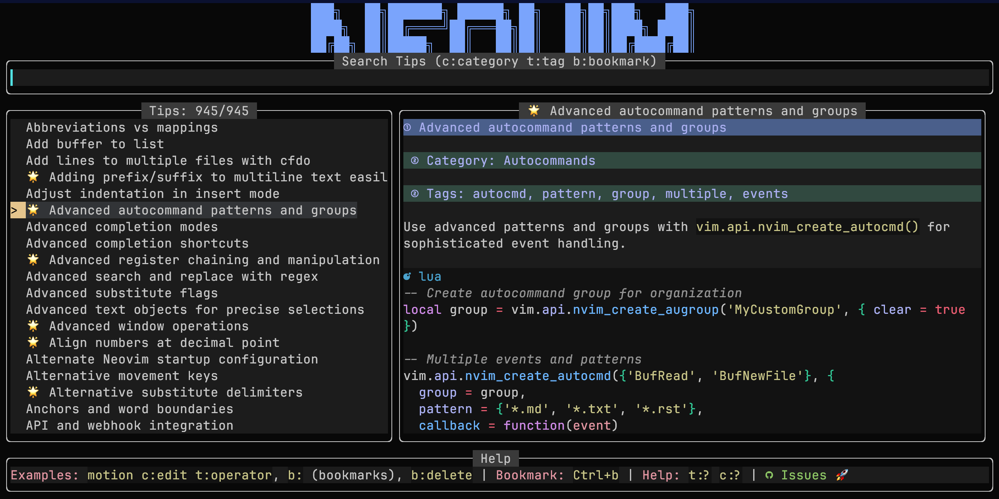
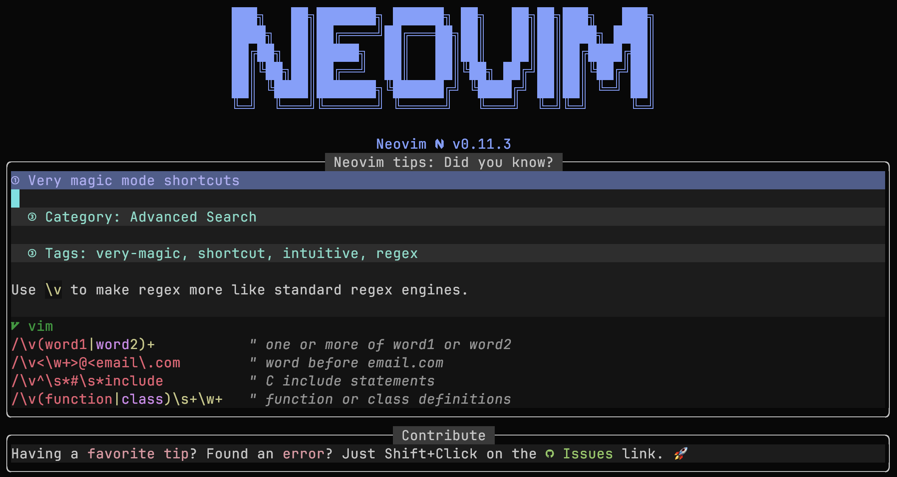

# Neovim Tips Plugin

*This Lua plugin for Neovim brings together hundreds of helpful tips, tricks, and shortcuts, all available through a custom picker. It’s easy to expand with your own entries, so the collection grows with you and your workflow.*







## 🎯 Purpose

I started to work on this little plugin because I **love** neovim and I still remember how difficult it was to learn the basic commands. I was like that [Twitter guy](https://x.com/iamdevloper/status/435555976687923200) who said: 

*"I've been using Vim for about 2 years now, mostly because I can't figure out how to exit it."*

The plugin should help you to learn some basic (:wq, write and quit) and some not so basic commands (ddp, move line down) related to neovim. 

## 🤝 Let's Collaborate

I have provided a solid initial batch of tips and if you have your favorite one that is not listed, I will be happy to include it in the next release **with proper credits**. Send your commands, tips and tricks to me, create an issue or submit a pull request. You can also add your own tips and tricks that will be stored on your local computer, you don't have to share anything with me.  

## ✨ Features
- **Beautiful custom picker**: Three-pane interface with search, tips list, and live markdown preview
- **Daily tip popup**: Get a random tip on startup (configurable: off, daily, or every launch)
- **Lightweight dependencies**: Only requires `nui.nvim` and `render-markdown` - no heavyweight pickers (fzf-lua, telescope, snacks, mini...)
- **Word-based search**: Intelligent search that matches all words (e.g., "insert character" finds "character to insert")
- **Live markdown rendering**: Preview rendered descriptions with full markdown support
- **Simple navigation**: Seamless mouse and keyboard navigation with smart mode switching
- **Cursor preservation**: Returns to your exact cursor position and mode after closing
- Support for categories, tags, and rich text
- Lazy loading for optimal startup performance
- The plugin comes with a starting set of ~600 curated tips
- You can add/edit unlimited number of personal tips stored in a configurable file
- User tips with configurable prefixes to prevent conflicts with builtin tips
- Automatic title conflict detection and warnings

## 📦 Installation

### Lazy.nvim

```lua
{
  "saxon1964/neovim-tips",
  version = "*", -- Only update on tagged releases
  dependencies = { 
    "MunifTanjim/nui.nvim",
    "MeanderingProgrammer/render-markdown.nvim" 
  },
  opts = {
    -- OPTIONAL: Location of user defined tips (default value shown below)
    user_file = vim.fn.stdpath("config") .. "/neovim_tips/user_tips.md",
    -- OPTIONAL: Prefix for user tips to avoid conflicts (default: "[User] ")
    user_tip_prefix = "[User] ",
    -- OPTIONAL: Show warnings when user tips conflict with builtin (default: true)
    warn_on_conflicts = true,
    -- OPTIONAL: Daily tip mode (default: 1)
    -- 0 = off, 1 = once per day, 2 = every startup
    daily_tip = 1,
  },
  init = function()
    -- OPTIONAL: Change to your liking or drop completely 
    -- The plugin does not provide default key mappings, only commands
    local map = vim.keymap.set
    map("n", "<leader>nto", ":NeovimTips<CR>", { desc = "Neovim tips", noremap = true, silent = true })
    map("n", "<leader>nte", ":NeovimTipsEdit<CR>", { desc = "Edit your Neovim tips", noremap = true, silent = true })
    map("n", "<leader>nta", ":NeovimTipsAdd<CR>", { desc = "Add your Neovim tip", noremap = true, silent = true })
    map("n", "<leader>ntr", ":NeovimTipsRandom<CR>", { desc = "Show random tip", noremap = true, silent = true })
  end
}
```

### packer.nvim

```lua
use {
  "saxon1964/neovim-tips",
  tag = "*", -- Only update on tagged releases
  requires = { 
    "MunifTanjim/nui.nvim",
    "MeanderingProgrammer/render-markdown.nvim" 
  },
  config = function()
    require("neovim_tips").setup {
      user_file = vim.fn.stdpath("config") .. "/neovim_tips/user_tips.md",
      user_tip_prefix = "[User] ",  -- Prefix for user tips
      warn_on_conflicts = true,     -- Warn about title conflicts
      daily_tip = 1,                -- Daily tip: 0=off, 1=once per day, 2=every startup
    }

    local map = vim.keymap.set
    map("n", "<leader>nto", ":NeovimTips<CR>", { desc = "Neovim tips", noremap = true, silent = true })
    map("n", "<leader>nte", ":NeovimTipsEdit<CR>", { desc = "Edit your Neovim tips", noremap = true, silent = true })
    map("n", "<leader>nta", ":NeovimTipsAdd<CR>", { desc = "Add your Neovim tip", noremap = true, silent = true })
    map("n", "<leader>ntr", ":NeovimTipsRandom<CR>", { desc = "Show random tip", noremap = true, silent = true })
  end
}
```

### vim-plug

```vim
Plug 'MunifTanjim/nui.nvim'
Plug 'MeanderingProgrammer/render-markdown.nvim'
Plug 'saxon1964/neovim-tips', { 'tag': '*' } " Only update on tagged releases

lua << EOF
require("neovim_tips").setup {
  user_file = vim.fn.stdpath("config") .. "/neovim_tips/user_tips.md",
  daily_tip = 1,  -- Daily tip: 0=off, 1=once per day, 2=every startup
}

local map = vim.keymap.set
map("n", "<leader>nto", ":NeovimTips<CR>", { desc = "Neovim tips", noremap = true, silent = true })
map("n", "<leader>nte", ":NeovimTipsEdit<CR>", { desc = "Edit your Neovim tips", noremap = true, silent = true })
map("n", "<leader>nta", ":NeovimTipsAdd<CR>", { desc = "Add your Neovim tip", noremap = true, silent = true })
map("n", "<leader>ntr", ":NeovimTipsRandom<CR>", { desc = "Show random tip", noremap = true, silent = true })
EOF
```

### minpac

```vim
call minpac#init()
call minpac#add('MunifTanjim/nui.nvim')
call minpac#add('MeanderingProgrammer/render-markdown.nvim')
call minpac#add('saxon1964/neovim-tips', {'tag': '*'}) " Only update on tagged releases

lua << EOF
require("neovim_tips").setup {
  user_file = vim.fn.stdpath("config") .. "/neovim_tips/user_tips.md",
  daily_tip = 1,  -- Daily tip: 0=off, 1=once per day, 2=every startup
}

local map = vim.keymap.set
map("n", "<leader>nto", ":NeovimTips<CR>", { desc = "Neovim tips", noremap = true, silent = true })
map("n", "<leader>nte", ":NeovimTipsEdit<CR>", { desc = "Edit your Neovim tips", noremap = true, silent = true })
map("n", "<leader>nta", ":NeovimTipsAdd<CR>", { desc = "Add your Neovim tip", noremap = true, silent = true })
map("n", "<leader>ntr", ":NeovimTipsRandom<CR>", { desc = "Show random tip", noremap = true, silent = true })
EOF
```

### paq-nvim

```lua
require "paq" {
  "MunifTanjim/nui.nvim";
  "MeanderingProgrammer/render-markdown.nvim";
  { "saxon1964/neovim-tips", tag = "*" }; -- Only update on tagged releases
}

require("neovim_tips").setup {
  user_file = vim.fn.stdpath("config") .. "/neovim_tips/user_tips.md",
  daily_tip = 1,  -- Daily tip: 0=off, 1=once per day, 2=every startup
}

local map = vim.keymap.set
map("n", "<leader>nto", ":NeovimTips<CR>", { desc = "Neovim tips", noremap = true, silent = true })
map("n", "<leader>nte", ":NeovimTipsEdit<CR>", { desc = "Edit your Neovim tips", noremap = true, silent = true })
map("n", "<leader>nta", ":NeovimTipsAdd<CR>", { desc = "Add your Neovim tip", noremap = true, silent = true })
map("n", "<leader>ntr", ":NeovimTipsRandom<CR>", { desc = "Show random tip", noremap = true, silent = true })
```

### dein.vim

```vim
call dein#begin('~/.cache/dein')

call dein#add('MunifTanjim/nui.nvim')
call dein#add('MeanderingProgrammer/render-markdown.nvim')
call dein#add('saxon1964/neovim-tips')

call dein#end()

lua << EOF
require("neovim_tips").setup {
  user_file = vim.fn.stdpath("config") .. "/neovim_tips/user_tips.md",
  daily_tip = 1,  -- Daily tip: 0=off, 1=once per day, 2=every startup
}

local map = vim.keymap.set
map("n", "<leader>nto", ":NeovimTips<CR>", { desc = "Neovim tips", noremap = true, silent = true })
map("n", "<leader>nte", ":NeovimTipsEdit<CR>", { desc = "Edit your Neovim tips", noremap = true, silent = true })
map("n", "<leader>nta", ":NeovimTipsAdd<CR>", { desc = "Add your Neovim tip", noremap = true, silent = true })
map("n", "<leader>ntr", ":NeovimTipsRandom<CR>", { desc = "Show random tip", noremap = true, silent = true })
EOF

```

### kickstart.nvim

```lua
require("lazy").setup({
  {
    "saxon1964/neovim-tips",
    dependencies = { 
    "MunifTanjim/nui.nvim",
    "MeanderingProgrammer/render-markdown.nvim" 
  },
    opts = {
      user_file = vim.fn.stdpath("config") .. "/neovim_tips/user_tips.md",
    },
    init = function()
      local map = vim.keymap.set
      map("n", "<leader>nto", ":NeovimTips<CR>", { desc = "Neovim tips", noremap = true, silent = true })
      map("n", "<leader>nte", ":NeovimTipsEdit<CR>", { desc = "Edit your Neovim tips", noremap = true, silent = true })
      map("n", "<leader>nta", ":NeovimTipsAdd<CR>", { desc = "Add your Neovim tip", noremap = true, silent = true })
      map("n", "<leader>ntr", ":NeovimTipsRandom<CR>", { desc = "Show random tip", noremap = true, silent = true })
    end,
  },
})
```

### AstroNvim

File `lua/user/plugins/neovim_tips.lua`:

```lua
return {
  {
    "saxon1964/neovim-tips",
    dependencies = { 
    "MunifTanjim/nui.nvim",
    "MeanderingProgrammer/render-markdown.nvim" 
  },
    opts = {
      user_file = vim.fn.stdpath("config") .. "/neovim_tips/user_tips.md",
    },
  },
}
```

File `lua/user/mappings.lua`

```lua
return {
  n = {
    ["<leader>nto"] = { "<cmd>NeovimTips<cr>", desc = "Neovim tips" },
    ["<leader>nte"] = { "<cmd>NeovimTipsEdit<cr>", desc = "Edit your Neovim tips" },
    ["<leader>nta"] = { "<cmd>NeovimTipsAdd<cr>", desc = "Add your Neovim tip" },
    ["<leader>nth"] = { "<cmd>NeovimTipsHelp<cr>", desc = "Neovim tips user guide" },
    ["<leader>ntr"] = { "<cmd>NeovimTipsRandom<cr>", desc = "Random Neovim tip" },
  },
}
```

## 💡 Daily Tip Feature

The plugin can show you a random tip in a beautiful popup when you start Neovim. This helps you discover new tips and improve your workflow naturally.

### Configuration Options:
- `daily_tip = 0`: Disabled (no popup)
- `daily_tip = 1`: Once per day (default)
- `daily_tip = 2`: Every Neovim startup

### Daily Tip Popup Features:
- **"Did you know?" popup**: Centered popup with random tip
- **Smart persistence**: Once daily mode uses `~/.local/share/nvim/neovim_tips/persistent.json` 
- **Full markdown rendering**: Rich formatting with render-markdown.nvim
- **Easy dismissal**: Close with `q` or `<Esc>`
- **Error reporting**: Includes GitHub issues link for feedback


## 🔧 Commands

- `:NeovimTips` — Open searchable list of tips with beautiful three-pane interface
- `:NeovimTipsEdit` — Edit your personal tips file
- `:NeovimTipsAdd` — Insert a new tip template into your personal file and start editing
- `:NeovimTipsRandom` — Displays random tip upon user request

## 📝 Tips

Each tip should follow this format:

````
# Title: My tip title
# Category: My category name
# Tags: tag1, tag2, tag3
---
This is a description of what the tip does.

```vim
some-command
```
===
````

This format is used for all tips, built-in or created by you and stored separately.

Each tip has to start with the `# Title:` line, followed by `# Category:` and a list of `# Tags`.

Description of the tip starts with `---` and ends with `===`. There is **NO** predefined format for description. Anything between the starting and ending marker will be interpreted as a text in markdown (.md) format. Fzf-lua will render the markdown description in the right FZF panel. 

## ✅ Example

````
# Title: Delete word under the cursor
# Category: Edit
# Tags: delete, word, cursor
---
In normal mode use `diw` to delete the word under the cursor.

```vim
diw 
```
===
````

## 📝 User-Defined Tips

The author of this plugin has done his best to provide a significant number of built-in Neovim commands, tips and tricks. But Neovim is an endless source of inspiration to many and, I believe, to you as well.

It is possible to mix your own tips with the built-in collection. Use `:NeovimTipsAdd` to add your own tip to the collection or `:NeovimTipsEdit` to edit the file with your custom tips. If the file for your custom tips does not exist, it will be created automatically. The location of the file can be adjusted (see "Configuration Options").

User tips follow the same format as builtin tips described above.

### Conflict Prevention

To prevent conflicts with builtin tips, user tips are automatically prefixed with `[User] ` by default. Do **NOT** add the prefix yourself. This means if you create a tip with the title `Join lines`, it will appear as `[User] Join lines` in the interface and will not interfere with the built-in tip with the title `Join lines`.

## ⚙️ Configuration Options

All configuration options are optional with sensible defaults:

```lua
require("neovim_tips").setup({
  -- Path to user tips file
  user_file = vim.fn.stdpath("config") .. "/neovim_tips/user_tips.md",
  
  -- Prefix added to user tip titles to prevent conflicts
  user_tip_prefix = "[User] ",
  
  -- Show warnings when user tips have conflicting titles with builtin tips
  warn_on_conflicts = true,
  
  -- Daily tip mode: 0=off, 1=once per day, 2=every startup
  daily_tip = 1,
})
```

### User Tip Prefix Examples

```lua
-- Default: [User] prefix
user_tip_prefix = "[User] "     -- "Join lines" becomes "[User] Join lines"

-- Custom emoji prefix  
user_tip_prefix = "🔧 "         -- "Join lines" becomes "🔧 Join lines"

-- No prefix (not recommended, may cause conflicts)
user_tip_prefix = ""            -- "Join lines" stays "Join lines"
```

### Features

- **Automatic prefixing**: User tips are automatically prefixed to avoid conflicts
- **Conflict detection**: Warnings when user tip titles match builtin tips
- **User tag**: All user tips automatically get a "user" tag for filtering
- **Same format**: User tips follow the exact same format as builtin tips

### Tips for Writing User Tips

- Use descriptive, unique titles
- Include relevant tags for easy searching
- Provide clear examples when applicable
- Test your tips before adding them
- Consider if your tip might be useful as a contribution to the main collection

## 🚫 Disabling Completion in Search Bar

If you're using completion engines like `blink.cmp` or `nvim-cmp` and want to disable autocompletion suggestions in the picker's search bar, you can use the custom filetype `neovim-tips-search`:

### For blink.cmp:
```lua
require('blink.cmp').setup({
  enabled = function()
    return vim.bo.filetype ~= "neovim-tips-search"
  end,
  -- ... rest of your config
})
```

### For nvim-cmp:
```lua
require('cmp').setup({
  enabled = function()
    return vim.bo.filetype ~= "neovim-tips-search"
  end,
  -- ... rest of your config
})
```

## 📁 Default File Locations

- Built-in tips: `<plugin_directory>/data/`
- User tips: `~/.config/nvim/neovim_tips/user_tips.md`

## 🔄 Roadmap Ideas

- Category/Tag filtering
- Search descriptions
- Multiple tip sources
- Export functionality

